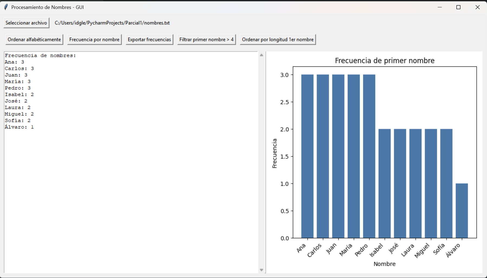
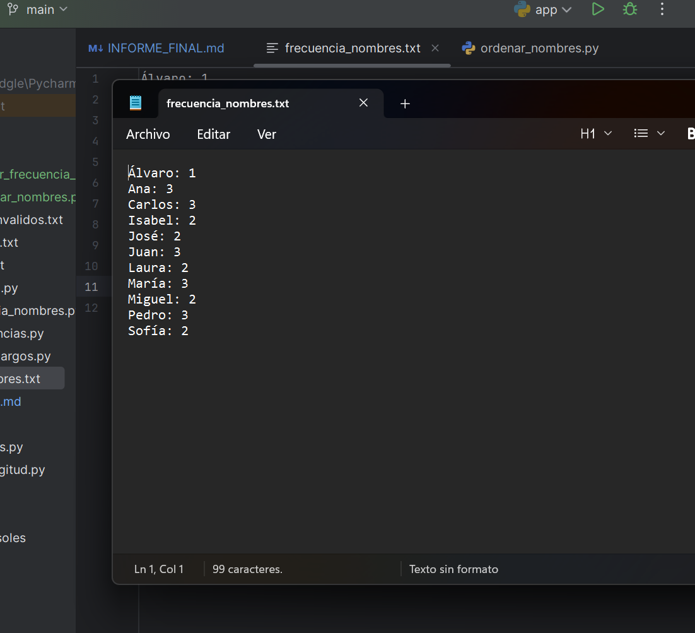

# INFORME FINAL - Proyecto de Procesamiento de Nombres

## Resumen del Proyecto

Este proyecto implementa un sistema completo de procesamiento de nombres que incluye ordenamiento alfabético, análisis de frecuencias, filtrado, exportación de datos y manejo robusto de errores. El proyecto está desarrollado en Python y utiliza técnicas avanzadas de manejo de texto con soporte para caracteres especiales y acentos.



## Estructura del Proyecto

```
Parcial1/
├── nombres.txt                          # Archivo de datos principal
├── ordenar_nombres.py                   # Script principal de ordenamiento
├── contar_frecuencia_nombres.py         # Análisis de frecuencias
├── exportar_frecuencias.py              # Exportación de datos
├── filtrar_nombres_largos.py            # Filtrado por longitud
├── ordenar_por_longitud.py              # Ordenamiento por longitud
├── capitalizar_titulo.py                # Capitalización de títulos
├── frecuencia_nombres.txt               # Archivo de salida generado
└── archivos de prueba(
archivo_datos_invalidos.txt,
archivo_invalido.txt,
archivo_vacio.txt)                  # Archivos para testing de errores
```

## Ejercicios Implementados

### 1. Ordenamiento Alfabético (`ordenar_nombres.py`)

**Objetivo:** Leer nombres de un archivo y organizarlos en orden alfabético, manejando correctamente acentos y tildes.

**Implementación:**
- Función `normalizar_para_ordenar()` que utiliza `unicodedata` para manejar acentos
- Función `ordenar_nombres_alfabeticamente()` que lee el archivo y ordena los nombres
- Manejo robusto de errores para diferentes escenarios

**Características técnicas:**
- Codificación UTF-8 para soporte completo de caracteres especiales
- Normalización Unicode (NFD) para ordenación correcta
- Filtrado de marcas diacríticas manteniendo la letra base
- Validación de datos de entrada

**Resultados:**
```
[EXITO] Nombres ordenados alfabéticamente:
========================================
 1. Álvaro Perez
 2. Ana Castillo
 3. Ana Gutiérrez
 4. Ana Martínez
 5. Carlos Rodríguez
 6. Carlos Romero
 7. Carlos Torres
 8. Isabel Hernández
 9. Isabel Jiménez
10. José Fernández
...
```

**Desafíos enfrentados:**
- Manejo correcto de acentos en la ordenación
- Compatibilidad con diferentes sistemas de codificación
- Validación de datos de entrada


---

### 2. Análisis de Frecuencias (`contar_frecuencia_nombres.py`)

**Objetivo:** Crear un diccionario con la frecuencia de cada primer nombre en la línea, porque la segunda palabra es apellido.

**Implementación:**
- Función `contar_frecuencia_nombres()` que procesa la lista de nombres
- Extracción del primer nombre usando `split()[0]`
- Conteo de frecuencias usando diccionario
- Reutilización de la función de lectura de `ordenar_nombres.py`

**Resultados:**
```
Frecuencia de nombres:
==============================
Ana: 3
Carlos: 3
Juan: 3
María: 3
Pedro: 3
Isabel: 2
José: 2
Laura: 2
Miguel: 2
Sofía: 2
Álvaro: 1
```

**Desafíos enfrentados:**
- Separación correcta de nombres y apellidos
- Manejo de nombres con acentos en las claves del diccionario
- Optimización del código para reutilizar funciones existentes


---

### 3. Exportación de Datos (`exportar_frecuencias.py`)

**Objetivo:** Exportar el diccionario de frecuencias a un archivo de texto con formato específico.

**Implementación:**
- Función `exportar_frecuencias_a_archivo()` que escribe al archivo
- Formato: "nombre: frecuencia" por línea
- Reutilización de funciones de los ejercicios anteriores
- Manejo de errores de escritura

**Resultados:**
Archivo `frecuencia_nombres.txt` generado:
```
Ana: 3
Carlos: 3
Juan: 3
María: 3
Pedro: 3
Isabel: 2
José: 2
Laura: 2
Miguel: 2
Sofía: 2
Álvaro: 1
```

**Desafíos enfrentados:**
- Formato correcto de salida
- Manejo de codificación en archivos de salida
- Integración con funciones existentes


---

### 4. Filtrado por Condición (`filtrar_nombres_largos.py`)

**Objetivo:** Filtrar nombres que tengan más de 4 caracteres en el primer nombre.

**Implementación:**
- Función `filtrar_nombres_largos()` que aplica el filtro
- Validación de longitud del primer nombre únicamente
- Estadísticas detalladas de filtrado
- Reutilización de la función de lectura

**Resultados:**
```
Filtrado de nombres por longitud del primer nombre:
============================================================
Longitud mínima del primer nombre: más de 4 caracteres
Total de nombres originales: 26
Total de nombres filtrados: 18

Nombres que cumplen la condición:
----------------------------------------
 1. Álvaro Perez (primer nombre: 'Álvaro' - 6 caracteres)
 2. Carlos Rodríguez (primer nombre: 'Carlos' - 6 caracteres)
 3. Carlos Romero (primer nombre: 'Carlos' - 6 caracteres)
...
```

**Desafíos enfrentados:**
- Distinción entre longitud del nombre completo vs. primer nombre
- Validación correcta de la condición de filtrado
- Presentación clara de resultados


---

### 5. Ordenamiento por Longitud (`ordenar_por_longitud.py`)

**Objetivo:** Ordenar nombres por longitud del primer nombre de forma descendente.

**Implementación:**
- Función `ordenar_por_longitud_descendente()` que ordena por longitud
- Estadísticas detalladas de distribución de longitudes
- Análisis de tendencias en los datos

**Resultados:**
```
Nombres ordenados por longitud del primer nombre (descendente):
============================================================
 1. Álvaro Perez (primer nombre: 'Álvaro' - 6 caracteres)
 2. Carlos Rodríguez (primer nombre: 'Carlos' - 6 caracteres)
 3. Carlos Romero (primer nombre: 'Carlos' - 6 caracteres)
...

Estadísticas de longitud del primer nombre:
----------------------------------------
Longitud máxima del primer nombre: 6 caracteres
Longitud mínima del primer nombre: 3 caracteres
Longitud promedio del primer nombre: 4.9 caracteres
```

**Desafíos enfrentados:**
- Ordenamiento correcto por longitud
- Análisis estadístico de los datos
- Presentación de resultados ordenados


---

### 6. Capitalización de Títulos (`capitalizar_titulo.py`)

**Objetivo:** Crear una función que capitalice títulos con excepciones específicas.

**Implementación:**
- Función `capitalizar_titulo()` con manejo de excepciones
- Lista configurable de palabras excepciones
- Manejo de signos de puntuación
- Múltiples ejemplos de prueba

**Resultados:**
```
Ejemplo con lista del ejercicio:
nombres = ['Juan Pérez', 'Juan García', 'Ana Martínez', 'Ana Castillo']
contar_frecuencia_nombres(nombres) = {'Juan': 2, 'Ana': 2}

Texto original: el señor de los anillos y la comunidad del anillo
Resultado: el Señor de los Anillos y la Comunidad del Anillo
```

**Desafíos enfrentados:**
- Lógica correcta de excepciones
- Manejo de signos de puntuación
- Casos edge en la capitalización


---

## Manejo de Errores Implementado

### Características del Sistema de Errores:

1. **Verificación de existencia de archivos**
2. **Detección de archivos vacíos**
3. **Validación de datos de entrada**
4. **Manejo de errores de codificación**
5. **Gestión de permisos de archivos**
6. **Recuperación graceful de errores**

### Ejemplos de Manejo de Errores:

**Archivo no existe:**
```
[ERROR] El archivo 'archivo_inexistente.txt' no existe.
   Verifica que la ruta del archivo sea correcta.
```

**Archivo vacío:**
```
[ERROR] El archivo 'archivo_vacio.txt' está vacío.
```

**Archivo con datos inválidos (strings extraños):**
```
[ADVERTENCIA] Se encontraron 3 líneas con datos inválidos:
   (Strings extraños, formato incorrecto, o solo espacios/saltos de línea)
   - '<?Assistant?>'
   - '<?tool?calls?begin?><?tool?call?begin?>'
   - 'run_terminal_cmd'

[INFO] Sin embargo, se encontraron 2 nombres válidos que serán procesados.

[EXITO] Nombres ordenados alfabéticamente:
========================================
 1. Ana García
 2. Juan Pérez
```

**Archivo con solo espacios y saltos de línea:**
```
[ADVERTENCIA] Se encontraron 1 líneas con datos inválidos:
   (Strings extraños, formato incorrecto, o solo espacios/saltos de línea)
   - '\n\n   \n\n   \n\n'

[ERROR] No se encontraron nombres válidos en el archivo 'archivo_invalido.txt'.
```

**Error de codificación:**
```
[ERROR] No se pudo decodificar el archivo 'archivo_corrupto.txt'.
   Error de codificación: 'utf-8' codec can't decode byte 0xff
   El archivo puede estar en una codificación diferente a UTF-8.
```

**Error de permisos:**
```
[ERROR] No tienes permisos para leer el archivo 'archivo_protegido.txt'.
```

**Mensaje genérico mejorado (GUI):**
```
[ERROR] No se pudieron obtener nombres del archivo.

Posibles causas:
• El archivo está vacío
• El archivo contiene solo espacios o líneas vacías
• El archivo no tiene el formato correcto (debe ser 'Nombre Apellido')
• Error de permisos o codificación del archivo
```

**Validación mejorada de formato:**
```
[ADVERTENCIA] Se encontraron 3 líneas con datos inválidos:
   (Strings extraños, formato incorrecto, o solo espacios/saltos de línea)
   - '<?Assistant?>'
   - '<?tool?calls?begin?><?tool?call?begin?>'
   - 'run_terminal_cmd'

[INFO] Sin embargo, se encontraron 2 nombres válidos que serán procesados.

[EXITO] Nombres ordenados alfabéticamente:
========================================
 1. Ana García
 2. Juan Pérez
```


---

## Arquitectura del Sistema

### Principios de Diseño Implementados:

1. **Reutilización de Código:** Los scripts posteriores importan y reutilizan funciones de scripts anteriores
2. **Separación de Responsabilidades:** Cada script tiene una función específica
3. **Manejo Robusto de Errores:** Sistema completo de validación y recuperación
4. **Compatibilidad Unicode:** Soporte completo para caracteres especiales
5. **Modularidad:** Funciones independientes y reutilizables

### Flujo de Datos:
```
nombres.txt → ordenar_nombres.py → [otros scripts]
                ↓
        [funciones reutilizadas]
```

---

## Resultados y Análisis

### Estadísticas del Dataset:
- **Total de nombres:** 26
- **Nombres únicos:** 11 diferentes
- **Distribución de frecuencias:**
  - Ana, Carlos, Juan, María, Pedro: 3 ocurrencias cada uno
  - Isabel, José, Laura, Miguel, Sofía: 2 ocurrencias cada uno
  - Álvaro: 1 ocurrencia

### Análisis de Longitudes:
- **Longitud máxima del primer nombre:** 6 caracteres (Álvaro, Carlos, Isabel, Miguel)
- **Longitud mínima del primer nombre:** 3 caracteres (Ana)
- **Longitud promedio:** 4.9 caracteres

---

## Desafíos Técnicos Enfrentados

### 1. Manejo de Acentos y Tildes
**Problema:** Ordenación incorrecta de nombres con acentos
**Solución:** Implementación de normalización Unicode con `unicodedata.normalize()`

### 2. Compatibilidad de Codificación
**Problema:** Errores de codificación en Windows
**Solución:** Uso consistente de UTF-8 y manejo de excepciones específicas

### 3. Reutilización de Código
**Problema:** Duplicación de lógica entre scripts
**Solución:** Sistema de importación y reutilización de funciones

### 4. Validación de Datos
**Problema:** Datos inválidos en archivos de entrada
**Solución:** Sistema robusto de validación con filtrado automático

---

## Conclusiones

### Logros Alcanzados:
1. ✅ Sistema completo de procesamiento de nombres
2. ✅ Manejo robusto de errores en todos los escenarios
3. ✅ Soporte completo para caracteres especiales
4. ✅ Arquitectura modular y reutilizable
5. ✅ Documentación completa del código
6. ✅ Casos de prueba para validación

### Aprendizajes Técnicos:
- Manejo avanzado de Unicode en Python
- Técnicas de normalización de texto
- Sistemas de manejo de errores robustos
- Arquitectura modular de software
- Validación y filtrado de datos

---

*Informe - Proyecto de Procesamiento de Nombres*
*Desarrollado por: Ursol Gleb*
